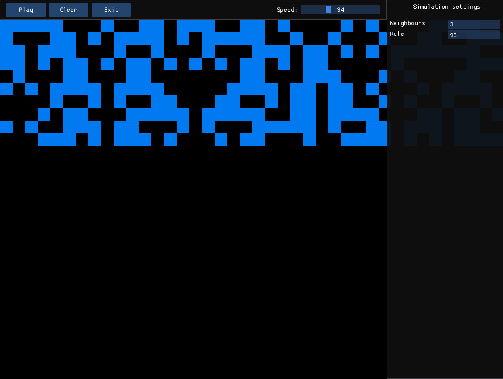

## 🧩 Advanced Automats
**A modular cellular automata playground with an ImGui-powered interface**

Advanced Automats is an interactive platform for running, exploring, and visualizing different types of cellular automata in real time.  

The project uses **Dear ImGui** for a flexible control interface, allowing you to switch rules, tweak simulation parameters, and experiment with various automata models.




## 🚀 Getting Started

### 1. Clone the repository
```bash
git clone --recurse-submodules https://github.com/wismh/advanced-automats.git
cd advanced-automats
```

### 2. Build
```bash
mkdir build
cd build
cmake ..
cmake --build .
```

### 3. Run
```bash
./AdvancedAutomats
```